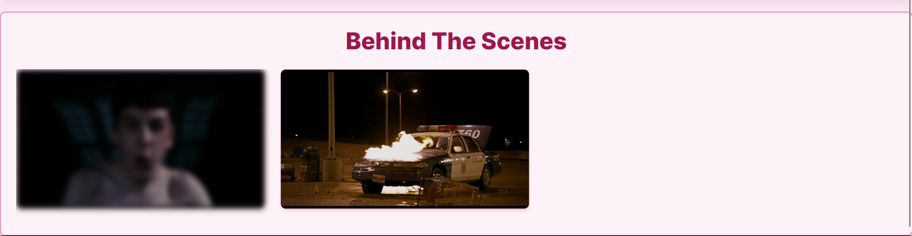
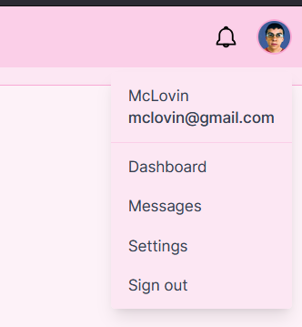

# SUPERBAD
### Practice Website
Superbad is a web application built to practice and showcase Tailwind CSS styling. This project features a retro pink theme and various sections to demonstrate Tailwind's capabilities in creating a modern, responsive design.

### Features
1. **Navigation Bar**: Includes a logo, search bar, and profile dropdown menu.
2. **Trending Moments**: A horizontally scrollable section showcasing memorable moments with a retro vibe.
3. **Behind The Scenes**: Features images with a blur effect that reveals their sharpness on hover.
4. **Memorable Quotes**: Displays a collection of quotes with a pink retro theme.
5. **Profile Card**

### PROJECT STRUCTURE
* ``resources/css/app.css``: Tailwind CSS configuration and custom styles.
* ``images/``: Directory containing image assets used in the project.
* ``icons/``: Directory for SVG icons.

### Tailwind CSS Configuration
The project uses Tailwind CSS for styling. The configuration file is located at tailwind.config.js. Tailwind classes are used throughout the HTML files to apply styles, ensuring a consistent and responsive design.

##  Screenshots
**Full Page**

**Navbar**

**Trending Moments**

**Memorable Quotes**

**Behind The Scenes**

**Profile Card**

